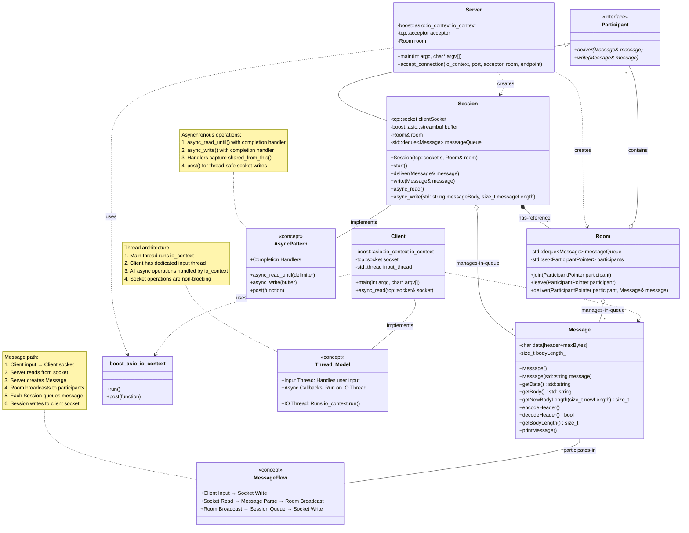

# ChatRoomImplementation

This project is a simple, multi-client chat room application built with C++. It uses the **Boost.Asio** library for asynchronous networking and **multi-threading** to handle concurrent users efficiently.

## Core Components

The application's architecture is built around three main classes:

  * **`Session`**: Manages an individual client's connection. It handles all asynchronous reading and writing of messages to and from the client's socket. Each session runs in its own thread.
  * **`Room`**: Represents the central chat room. It maintains a list of all connected participants, allowing it to broadcast incoming messages to every client in the session.
  * **`Message`**: A simple class that encapsulates the data being sent. It handles the encoding and decoding of message headers and bodies for network transmission.

## Low-Level Design



## Build and Run

1.  **Clone** the repository.
2.  Download and set up the libraries from the official [Boost release page](https://www.boost.org/releases/latest/).
    **Note:** This project is best developed and run on a Linux-based system. 🐧
3.  **Build** the project by running `make`.
4.  **Start the Server**:
    ```bash
    ./chatApp <port>
    ```
5.  **Start a Client**:
    ```bash
    ./clientApp <port>
    ```
